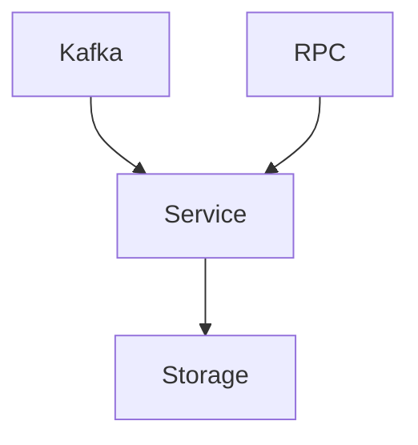

In my work at building the data-platform at Creandum we needed a key
value store that has a high write throughput and low read latency for
batches of data, and to do this for a medium data set. In terms of
performance, especially for writes, speed is very much a feature so
we need all the performance we can get. We had already implemented
Kafka in our architecture, and using it we can get many desirable
properties without having to write a lot of code.

Kafka is one of thoose pieces of software that can really define a
tech stack. On the surface Kafka seems very similar to a traditional
message queue - using kafka allows us to send messages from a single
producer to multiple consumers. Consumers can keep track of their
progress, and process messages as they are received. In reality
though, while Kafka has many of the same usecases as traditional
messages queues, it offers a completely different set
of tradeoffs. In Kafka's view of the world a subject (or topics to use
the Kafka nomenclature) is a set of logs, each called a
partition. These parititions are then spread out across the Kafka
clusters with one node being designated the master for a partition and
a configurable number of nodes being assigned the roles of replicas.

Consumers don't directly track exactly what messsages have been
received but rather keep track of their position within the log. The
consumer state might then be expressed as: I'm 500 bytes into
partition number five of the topic "foo" - and so forth for each
partition. If we want to split the workload, we simply assign workers
to partitions, in constrant to more traditional messages queues which
would spread out the individual messages.

To keep track of how messages are assigned to partitions Kafka
messages contain a key - an arbitrary value set by the
user. When messages are published the key is hashed and used to assign
the message to a partition. Two messages with the same key would be
assigned to the same partition, and be ordered with respect to
oneanother. This property is very useful when designing distributed
systems because it allows us to easily reason about the order of
events. It also ensures that messages with the same key often are sent
to the same consumer, which can be used to improve performance for
caches and the like.

Unlike in traditional messages queues messages are not removed when
they have been consumed. Instead deletion is instead performed in the
background in a way configured by the user. The user might for
instance choose to say that messages older than X seconds should be
scheduled to be cleaned up or that a topic shouldn't be allowed to
grow to a size greater than Y gigabytes. Finally, and what is in my
mind one of the most briliant things about Kafka is that you can
configure it to only retain the most recent message with a given
key. In the Kafka world this is called log compaction.

Kafka, when set to only retain the most recent message with a given
key behaves almost like a normal key value store,
instead of keeping a complete history, we keep only the very last
message with a given key, exactly like a key value store.

There are two caveats to this however: First, there is no guarantee
for when Kafka actually deletes irrelevant messages - so we might get
the any number of messages with a given key, luckily they are in order
so we will get the correct one last. Second, Kafka doesn't keep an
index of what keys there are and what the most recent value for it is.

To get around these two problems we need to build a service that keeps
track of the most recent value for each key. Essentially a key-value
store fed by Kafka.

Now before proceeding further with the design, it is useful to decide
on a language. For this project there are a lot of viable solutions,
decently fast languages on the JVM would work, as would Golang, C and
C++ are definitely candidates especially in a small service such as
this one. Erlang and Elixir would have been great options if it
weren't for the fact that their runtime, BEAM, places larger binaries
on a shared heap rather in process memory.

Limiting the choice to other languages that are in use at Creandum, we
are left to choose between Golang, TypeScript and Rust. All are
languages that can perform exceptionally well for this type of
workload. Out of these three, Rust is the only one that does not use
garbage collection. A garbage collector when active introduces latency
to the application, by momentarily pausing the application. In most
cases it is unnoticeable however, for certain applications may be more
problematic for the garbage collector than others. In addition to
avoiding garbage collection related latency, Rust offers excellent
performance and memory usage on par with C and far ahead of Golang
which is closer to Java than to Rust. In terms of developer ergonomics
Rust also outshines Golang, while Rust is obviously the more complicated
language. Golang fails to leverage its simplicity to actually produce
value for the developer. Things such as dependency management are
incredibily inelegant and have only recently approached a level
competitive with estalbished languages such as Java. That being said,
Golang laid the ground work for modern developer ergonomics by
widening the scope for what should be solved by developer tooling.

Another area where Golang shines is its library
ecosystem. Rust doesn't quite have the coverage of Golang, with the
exception perhaps C interop where Rust seems to be ahead. That being
said many of the libraries avaliable for Rust are of excellent
quality, both in terms of technical merits and ease of use.

Of particular interest to our project are libraries that provide
on-disk key-value storage that we can build of which there are a
few. There are certainly are mature libraries out there wrapping
things such as RocksDB and the like. For this service however, I
decided to go with something a bit more exciting, namely `sled`. Other
than being extremly ergonomic to use in Rust it has many cutting edge
features. `sled` humrously refers to itself the Champagne of
beta-databases, hinting perhaps at the possibility for
data-loss. Luckily for us Kafka is our persistent storage, so losing
our data is not a huge problem. So lets see what the storage layer of the future looks like.

```rust
let tree = sled::open("/tmp/sled")?;
let old_value = tree.insert("key", "value")?;
let new_value = tree.get(&"key")?;
```

With this short example, we have seen all the operations we need to
make a key value store. It is amazing how the interface for a cutting
edge, high performance database can have such a simple interface, this
speaks volumes of how elegant Rust can be with proper API design. As
often is the case with Rust there is some magic going on behind the
scenes, for performance reasons sled uses a type called `IVec` to
represent byte arrays internally, specifically this trick allows
shorter IVec's to be allocated on stack which improves performance in
many cases.


Now that we have all the tools that we need, it is time to figure out
the design of the service. Before we start thinking about how we
should implement the service, we need to define what the service
should do. To do this we need to sketch out the operations that the
system can perform. For our purposes we just need a
simple key value store that stores the most recent value and allows us
to retrive it. For our use case it would also be desirable to have a
batch getting operation, that would allow us to fetch multiple values
in one network roundtrip.

- `get(key)` -> Possibly a value or nothing at all
- `get_many(keys)` -> A list of (values or nothing)
- `insert(key, value)` -> Nothing

Of course all of these operations can yield errors, but a huge benefit
of Rust here is that we are able to model both the possiblity of
missing values and the possibility of errors within the type system of
the languge using the `Option` and `Result` types respectively. This
makes things much easier to reason about than they would have been in
a language with Null values and exceptions.

The aforementioned operations are to be called in different ways,
something we must consider in designing the system. We will be getting
inserts from Kafka. While gets should be sent using some type
of RPC style protocol.

A decent design for a system like this is to wrap the different
protocols in different modules. This means one module each for Kafka
and RPC. It also seems like a sound idea to wrap the storage layer so
that it doesn't expose the internals of Sled to the rest of the
application. Finally in the interest of readability we might have
`service` module, some will argue that it is not necessary and as it
will be a thin layer between the different modules, it has the
advantage of making the code more adaptable.




With the design done, it seems like a good point to take a break
before continuing on with Part 2 - where we will start implementing
our service


